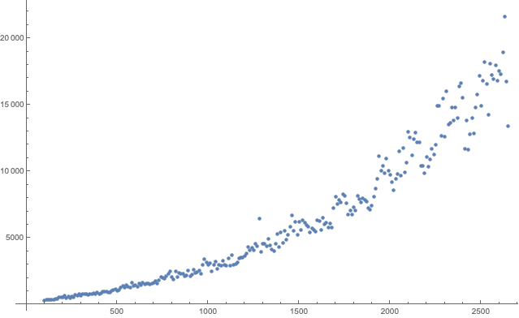

# Eulerian Tour Finder

This is a little script for finding Eulerian Tours in graphs. You can read about Eulerian Tours [here](http://mathworld.wolfram.com/EulerianCycle.html). Some people call them Eulerian Cycles as well.


It is currently capiable of generating graphs with valid tours as well. This is actually fairly non-trivial and is imho probably one of the most interesting parts of this project. The algorithm is as follows:

```c++
// Generates a graph with a valid eulerian tour.
//     1. Select two nodes.
//     2. Connect them.
//
//     3. Selet a connected node.
//     4. Connect it to an unconnected node.
//     5. Repeat 3 and 4 until all nodes are connected.
//
//     6. Classify each node as even or odd.
//     7. Select an odd node.
//     8. Connect it with another valid odd node.
//     9. If there are no other valid odd nodes:
//          - Connect it to a random even one.
//     10. Repeat 7 - 9 until there are no more odd nodes.
```

## Performance

At the moment it is quite quick. The goal is for it to run in linear time though and at the moment it doesn't look too good for it. Here is a graph of its performance. Along the X axis is the number of edges in the graph, and the Y axis is the number of microseconds it takes to find a tour.



## Compiling

If you'd like to use this yourself all you'll need is a C++ compile that supports C++17. Once you have that compilation is pretty easy. The below command will compile it and output its performance data into a `.tsv` file.

```
clang++ main.cpp -o main -O3 -Wl,-stack_size -Wl,0xF000000
./main > bigData.tsv
```

